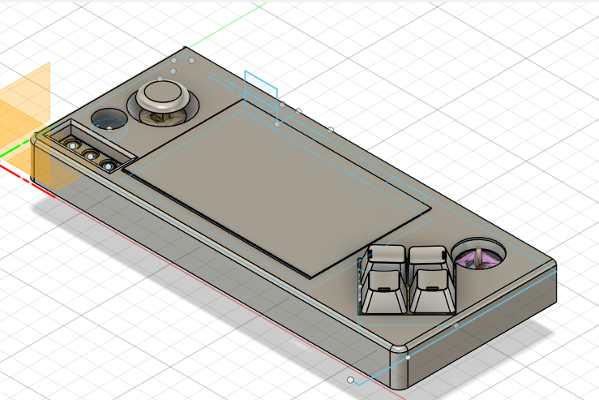
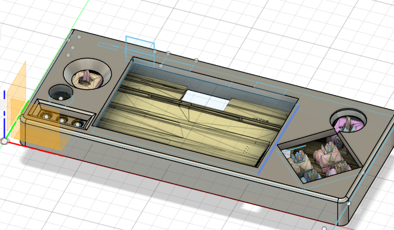
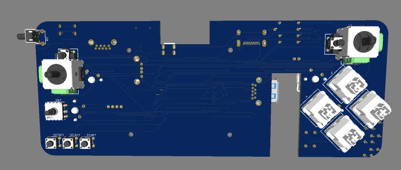
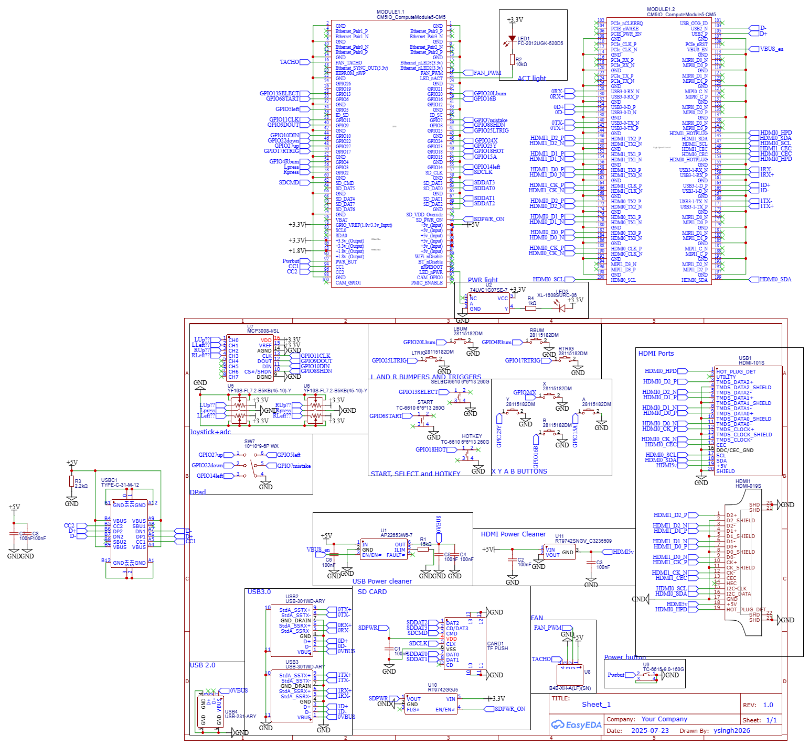

# Custom Game Console with Raspberry Pi CM5
[Read the project build journal](journal.md) for detailed progress updates and technical notes.
Edit: Please note price has changed since input on the form
## Description
This is a custom-built handheld game console powered by a Raspberry Pi Compute Module 5. The project features a custom-designed PCB and 3D-printed case, creating a portable gaming device capable of running retro games and modern indie titles.

## Why I Made This
I wanted to create a unique handheld gaming experience by combining the power of the Raspberry Pi CM5 with custom hardware design. This project allows for complete control over the form factor, button layout, and overall user experience.

## Images
### Physical Build (in progress)

### Full 3D Model

### PCB Design and Layout

## Bill of Materials (BOM)

| Item                | Description                                                        | Qty | Unit Price (USD) | Total Price (USD) | Notes/Link                   |
|---------------------|--------------------------------------------------------------------|-----|------------------|-------------------|------------------------------|
| Raspberry Pi CM5    | Raspberry Pi Compute Module 5 - 16GB Wireless, 4GB RAM          | 1   | $72.34           | $72.34            | Main processing unit ($65.00 + $7.34 tax) - [SparkFun](https://www.sparkfun.com/raspberry-pi-compute-module-5-16gb-wireless-4gb-ram.html?src=raspberrypi) |
| **Amazon Order**    | **Combined Amazon order for cooling, keycaps and power supply**   | 1   | **$42.35**       | **$42.35**        | **Subtotal: $32.96, Shipping: $6.99, Tax: $2.40** |
| - Cooling System    | Active cooling solution for CM5                                   | 1   | $17.47           | $17.47            | [Amazon](https://www.amazon.com/gp/product/B0DZJ54C21/ref=ox_sc_act_title_1?smid=A3VQUOB398QJN8&psc=1) |
| - Keycaps           | Clear keycaps                                                      | 1   | $7.50            | $7.50             | [Amazon](https://www.amazon.com/gp/product/B00FYO8EDC/ref=ox_sc_act_title_1?smid=A2SZMU3XQK0G75&psc=1) |
| - Power Supply      | 5V 5A USB-C Power Adapter                                         | 1   | $12.99           | $12.99            | [Amazon](https://www.amazon.com/RasTech-Power-Supply-Raspberry-Adapter/dp/B0CLV6WB4L/) |
| Custom PCB          | Custom designed PCB for CM5 and peripherals                       | 1   | $54.35           | $54.35            | Updated cost                 |
| LCD Display         | 5" IPS LCD Display with touch capability                          | 1   | $0.00            | $0.00             | I have my own                |
| 3D Printed Case     | Custom designed case parts                                         | 1   | $8.00            | $8.00             | PLA plastic material         |
| Buttons & Controls  | Tactile switches, D-pad, analog sticks                           | 1   | $0.00            | $0.00             | 3D printed                   |
| Self Soldering BOM  | Components for self assembly                                       | 1   | $28.67           | $28.67            | Merchandise: $17.54 + Shipping: $11.36 - Discount: $0.23 (check PCB for BOM folder) |
| **Total**           |                                                                    |     |                  | **$197.71**       |                              |

You can also download and open [bom.csv](bom.csv) directly to see all rows.

