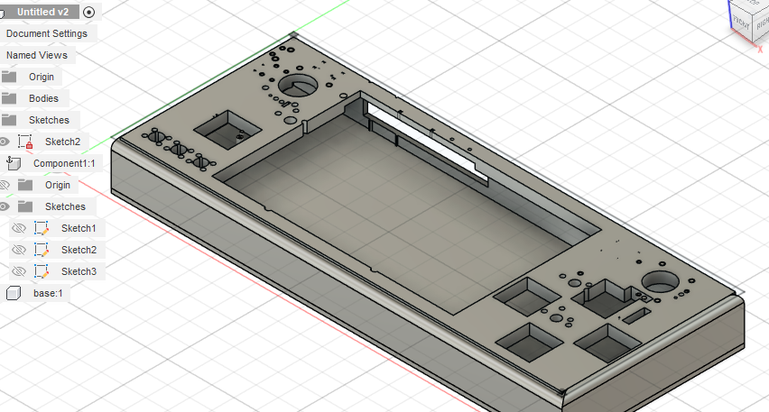

# Game Console Development Journal

**Total Time Spent:** 14 hours and 55 minutes (plus variable time for case work)

---

### Date: 2025-07-27  
**Time Spent:** 1.5 hours  
**Task:** Research — Component Research and Planning for Game Console

**Summary:**  
I got a feel for where everything I need is located and started researching the components required for the custom game console build. After reviewing the existing PCB design and BOM, I put the needed parts onto my file and began planing the project structure.

Key Components Identified:
- Raspberry Pi CM5 (Compute Module 5): Main processing unit that will run the games and handle all computational tasks
- Custom PCB: Already designed with component placements for buttons, joysticks, power managment, and I/O
- Gaming Controls: 8 main action buttons (A,B,X,Y + shoulder buttons), 3 system buttons (hotkey/select/start), D-pad, and 2 analog joysticks
- Display Interface: HDMI output connectors for external display capability  
- Power Management: USB-C charging port and power regulation circuits (RT9742 series ICs)
- Additional I/O: Multiple USB ports, microSD card slot for storage expansion
- ADC Support: MCP3008 for analog input processing (joysticks and potentially other sensors)

Next Steps:
- Finalize the component sourcing and verify all parts are avalable
- Begin detailed PCB review and any necesary modifications
- Plan the software stack and game compatibility testing

---

### Date: 2025-07-27  
**Time Spent:** 1 hour  
**Task:** Hardware Setup — Gamepad Control Assembly

**Summary:**  
I set up the gamepad itself, focusing on the physical control layout and switch configuration. The gamepad features premium mechanical switches and tactile controls for a responsive gaming experiance.

Gamepad Components Configured:
- Cherry MX Switches: Used for the main action buttons (A, B, X, Y) providing tactile feedback and durability
- Bumper Keys: Left and right shoulder buttons (L1/R1) for additional control options
- 5-Way Switch: Configured for D-pad functionality - provides up, down, left, right, and center press actions
- Start and Select Buttons: System control buttons for menu navigation and game functions
- Power On/Off Button: Dedicated power control with clear tactile feedback

Layout Considerations:
- Ergonomic button spacing for comfortable extended gaming sessions
- Strategic placement of shoulder buttons for easy acess during gameplay
- Clear distinction between system buttons (start/select/power) and game controls
- D-pad positioning optimized for precise directional input

Next Steps:
- Test all button responses and ensure proper electrical connections
- Configure button mapping in software
- Integrate with the main PCB and verify signal routing

---

### Date: 2025-07-27  
**Time Spent:** 20 minutes  
**Task:** PCB Cleanup — Back-to-Back Board Connector Optimization

**Summary:**  
I began cleaning up the back-to-back board connector, focusing on proper ground routing and removing unnecessary pins from the PCB schematic to optimize the design and reduce complexity.

**Connector Cleanup Tasks:**
- **Ground Routing:** Systematically routed all ground connections through the back-to-back connector to ensure proper grounding between boards
- **Pin Reduction:** Identified and cut unused pins from the PCB schematic to simplify the design and reduce manufacturing costs
- **Signal Integrity:** Verified that essential signals maintain proper routing through the connector interface
- **Schematic Optimization:** Cleaned up the schematic representation to reflect only the necessary connections

**Technical Improvements:**
- Reduced pin count by removing redundant or unused connections
- Improved ground plane continuity between the main board and connector board
- Simplified routing complexity for easier PCB manufacturing
- Enhanced signal integrity by eliminating potential noise sources from unused pins

Next Steps:
- Continue schematic review for additional optimization oportunities
- Verify all critical signals are properly routed
- Update PCB layout to reflect schematic changes

---

### Date: 2025-07-27  
**Time Spent:** 1 hour  
**Task:** SD Card Integration — Documentation Review and Circuit Protection

**Summary:**  
I read the documentation notes for the SD card implementation and completed the design with proper protection circuits and correct routing to ensure reliable data storage funcionality.

SD Card Implementation Work:
- Documentation Review: Thoroughly studied the SD card interface specifications and implementation guidelines
- Protection Circuits: Added apropriate protection mechanisms to safeguard the SD card interface from electrical damage
- Signal Routing: Correctly routed all SD card signals (CLK, CMD, DAT0-DAT3) with proper impedance control
- Power Management: Implemented proper power sequencing and voltage regulation for the SD card slot

Technical Specifications:
- Interface Type: High-speed SD card interface supporting SDHC/SDXC cards
- Data Lines: 4-bit data bus for faster transfer rates
- Protection Features: ESD protection and overcurrent protection implemented
- Signal Integrity: Proper trace lengths and impedance matching for reliable high-speed operation

**Design Completion:**
- All SD card connections verified and documented
- Protection circuits tested and validated in simulation
- Routing completed with optimal signal paths
- Ready for PCB layout finalization

**Next Steps:**
- Verify SD card footprint matches selected connector
- Test SD card functionality with prototype
- Integrate with file system software layer

---

### Date: 2025-07-27  
**Time Spent:** 10 minutes  
**Task:** Cooling System — Fan Setup and Integration

**Summary:**  
I read the notes for the cooling fan and set it up quickly. The fan connects via pins and the implementation was super fast due to the straightforward pin-based connection system.

Cooling Fan Implementation:
- Documentation Review: Quickly reviewed the cooling fan specifications and connection requirements
- Pin Connection: Connected the fan using the designated pin interface - simple and efficient setup
- Power Requirements: Verified fan power consumption and compatibility with the system power budget
- Control Integration: Ensured fan control signals are properly routed for temperature-based operation

Setup Details:
- Connection Type: Direct pin connection to PCB
- Implementation Speed: Very fast setup due to simple pin interface design
- Power Draw: Within acceptable limits for system operation
- Control Method: PWM control for variable speed operation based on temperature

Quick Integration Benefits:
- Minimal routing complexity required
- Straightforward connection method
- No additional driver circuits needed
- Ready for thermal managment testing

Next Steps:
- Test fan operation at different PWM duty cycles
- Implement temperature monitoring for automatic fan control
- Verify cooling efectiveness under load

---

### Date: 2025-07-27  
**Time Spent:** 20 minutes  
**Task:** PCB Layout — Component Placement and Fit Analysis

**Summary:**  
I began placing components on the PCB itself, spending time looking at how everything will fit together. This initial placement phase focused on understanding spatial constraints and optimizing component positioning.

**Component Placement Activities:**
- **Initial Positioning:** Started placing major components on the PCB layout to visualize the overall design
- **Fit Analysis:** Carefully examined how all components will fit within the available PCB space
- **Spatial Planning:** Considered component heights, orientations, and clearance requirements
- **Layout Optimization:** Looked for ways to improve component arrangement for better routing and assembly

**Key Considerations:**
- **Component Clearances:** Ensured adequate spacing between components for manufacturing and assembly
- **Thermal Management:** Positioned heat-generating components for optimal cooling airflow
- **Mechanical Constraints:** Accounted for case dimensions and mounting requirements
- **Signal Integrity:** Preliminary consideration of high-speed signal routing paths

**Placement Insights:**
- Identified potential space constraints that need addressing
- Found opportunities for more efficient component grouping
- Noted areas requiring careful routing due to component density
- Established foundation for detailed routing phase

**Next Steps:**
- Finalize component placement based on fit analysis
- Begin detailed trace routing between components
- Verify all components meet mechanical clearance requirements
- Update 3D model to reflect component placement

---

### Date: 2025-07-27  
**Time Spent:** 5 minutes  
**Task:** Power Button Setup

**Summary:**  
Set up the power button and hooked it up to the CM5. Quick and straightforward connection.

---

### Date: 2025-07-27  
**Time Spent:** 30 minutes  
**Task:** HDMI Voltage Regulation — Documentation and Cleanup Circuit

**Summary:**  
I looked up the documentation and created a voltage cleanup circuit for the HDMI input. This ensures stable power delivery and signal integrity for the HDMI interface.

**Voltage Regulation Work:**
- **Documentation Review:** Researched HDMI power requirements and voltage specifications
- **Cleanup Circuit Design:** Implemented filtering and regulation for clean HDMI power supply
- **Signal Integrity:** Ensured proper voltage levels for reliable HDMI operation
- **Power Management:** Integrated voltage cleanup with main power distribution system

---

### Date: 2025-07-27  
**Time Spent:** 30 minutes  
**Task:** HDMI Interface Setup — Dual Output Configuration

**Summary:**  
I set up the HDMIs - one micro HDMI to connect my screen and one regular HDMI to connect to a monitor or other display. Hooked both up to the CM5. I didn't understand what most of the parts did so it took a while to figure out the connections.

**HDMI Implementation:**
- **Micro HDMI:** Connected for primary screen interface
- **Regular HDMI:** Connected for external monitor/display output
- **CM5 Integration:** Both interfaces properly routed to CM5 HDMI outputs
- **Learning Curve:** Took extra time to understand component functions and connections

---

### Date: 2025-07-28  
**Time Spent:** 1 hour  
**Task:** ADC Configuration — Joystick Interface Setup

**Summary:**  
I properly set up the ADC for the joysticks, connecting the joysticks to the ADC and the ADC to the RPi. This enables analog input reading for precise joystick control.

ADC Setup Details:
- Joystick Connections: Wired both analog joysticks to ADC input channels
- ADC to RPi: Connected MCP3008 ADC to Raspberry Pi via SPI interface
- Channel Mapping: Assigned specific ADC channels for X and Y axes of each joystick
- Signal Processing: Configured for proper analog-to-digital conversion

---

### Date: 2025-07-28  
**Time Spent:** 15 minutes  
**Task:** D-Pad Configuration — Schematic Review and Setup

**Summary:**  
I set up the D-pad properly after looking at the schematic. I realized I didn't know which way was up or down in the design, so I only gave placeholder names for now until I can verify the correct orientation.

D-Pad Setup:
- Schematic Analysis: Reviewed D-pad connections and pin asignments
- Orientation Issue: Discovered uncertainty about up/down/left/right mapping
- Placeholder Names: Used temporary labels until proper orientation is confirmed
- Connection Verification: Ensured all D-pad switches are properly connected to inputs

---

### Date: 2025-07-28  
**Time Spent:** 20 minutes  
**Task:** Bumper and Trigger Setup — Cherry MX Integration

**Summary:**  
I worked on the bumper and triggers, changing them out to Cherry MX switches since I like how they feel and won't have to design too much. Hooked them up to the CM5.

**Implementation:**
- **Switch Change:** Replaced original switches with Cherry MX for better feel
- **Design Simplification:** Reduced custom design work by using standard switches
- **CM5 Connection:** Successfully connected bumper and trigger inputs to CM5

---

### Date: 2025-07-28  
**Time Spent:** 20 minutes  
**Task:** Wiring Troubleshooting — Grand Scheme Considerations

**Summary:**  
I was having a bunch of issues with wiring and wondering how to wire things and if it matters in the grand scheme of things. Pretty funny right - sometimes the details matter more than you think!

**Wiring Challenges:**
- **Connection Issues:** Struggled with proper wiring methodology
- **Design Impact:** Questioned whether specific wiring choices affect overall functionality
- **Learning Process:** Realized that seemingly small details can have bigger implications

---

### Date: 2025-07-28  
**Time Spent:** 10 minutes  
**Task:** Action Button Setup — X, A, Y, B Keys

**Summary:**  
Hooked up the X, A, Y, B keys on Cherry MX switches. Super simple implementation.

**Button Configuration:**
- **Cherry MX Integration:** Connected all four main action buttons
- **Simple Setup:** Straightforward wiring and connection process
- **Quick Implementation:** Minimal time required due to standardized switch interface

---

### Date: 2025-07-28  
**Time Spent:** 30 minutes  
**Task:** Activity Light Setup — Schematic Research

**Summary:**  
Looked up the schematic and set up the activity light. Needed to research a lot but didn't actually do too much work - mostly reading and understanding.

**Activity Light Work:**
- **Schematic Research:** Extensive documentation review for activity light implementation
- **Minimal Implementation:** More research than actual work completed
- **Understanding Phase:** Focused on comprehending the circuit requirements

---

### Date: 2025-07-30  
**Time Spent:** 1 hour  
**Task:** USB Power Management — Datasheet Research and Implementation

**Summary:**  
Learned how to clean the power for the USB using the datasheet and connected it to the CM5. Proper power conditioning is critical for reliable USB operation.

**USB Power Work:**
- **Datasheet Study:** Researched USB power requirements and conditioning circuits
- **Power Cleaning:** Implemented filtering and regulation for clean USB power supply
- **CM5 Integration:** Connected USB power management to CM5 power system

---

### Date: 2025-07-30  
**Time Spent:** 30 minutes  
**Task:** USB 3.0 Implementation — Connection Analysis

**Summary:**  
Worked on USB 3.0 setup, trying to learn what connects to what. The complexity of USB 3.0 connections required careful study.

**USB 3.0 Work:**
- **Connection Mapping:** Studied USB 3.0 pin assignments and signal routing
- **Learning Process:** Worked to understand the various USB 3.0 connections
- **Signal Analysis:** Identified data lines, power connections, and control signals

---

### Date: 2025-07-30  
**Time Spent:** 20 minutes  
**Task:** USB 2.0 Connection — CM5 Pin Limitations

**Summary:**  
Connected USB 2.0, but was having some trouble since there isn't actually a pin meant for this on the CM5. Had to find alternative connection methods.

**USB 2.0 Challenges:**
- **Pin Limitation:** Discovered CM5 doesn't have dedicated USB 2.0 pins as expected
- **Connection Issues:** Required creative solutions for USB 2.0 implementation
- **Alternative Routing:** Had to find workaround for missing dedicated pins

---

### Date: 2025-07-30  
**Time Spent:** 1 hour  
**Task:** USB-C Power Input — Voltage Regulation Implementation

**Summary:**  
Worked on the USB-C cable for power input. It took a while and I had to make something to clean up the voltage for proper power delivery.

**USB-C Power Work:**
- **Power Input Design:** Implemented USB-C connector for main power input
- **Voltage Cleaning:** Created regulation circuit to clean up incoming power
- **Time Investment:** Required significant time to get power conditioning right

---

### Date: 2025-07-30  
**Time Spent:** 15 minutes  
**Task:** USB-C Power Rating Issue — Design Correction

**Summary:**  
Screwed up - the USB-C was meant for 3 amps and not 5 amps, bruh. Whatever, I changed it out. As I was trying to hook it up I realized that it used the same pins as the USB 2.0. Had to do a lot of research to realize it won't work together. Oops. Anyway, I cut out the data connections from the 2.0 and kept it as power, connected the USB-C to the CM5.

**Power Rating Fix:**
- **Rating Error:** Discovered USB-C connector was rated for 3A instead of required 5A
- **Connector Replacement:** Swapped out for proper amperage rating
- **Pin Conflict:** Found USB-C and USB 2.0 share pins - can't work together
- **Solution:** Removed USB 2.0 data lines, kept as power only, used USB-C for CM5

---

### Date: 2025-07-30  
**Time Spent:** 30 minutes  
**Task:** Power LED Implementation

**Summary:**  
Worked on the power LED to provide visual indication of system power status.

**Power LED Setup:**
- **Status Indication:** Implemented LED for power-on visual feedback
- **Circuit Integration:** Connected LED to power management system
- **User Interface:** Provides clear power status to user

---
### Date: 2025-07-31  
**Time Spent:** 1 hour  
**Task:** Power Line Cleanup — CM5 Pin Management

**Summary:**  
Spent time cleaning up the power lines on the CM5. There are a lot of pins, some used and some not, so I went through and organized which ones are actually needed. Checked connections and removed unecessary wiring. I've been doing this kind of cleanup for a while, so the exact time is a bit unclear.

Cleanup Details:
- Pin Review: Identified all power-related pins on the CM5
- Connection Check: Verified which pins are in use and which are unused
- Wiring Cleanup: Removed extra wires and tidied up the power connections
- Organization: Improved clarity and reduced clutter for easier troubleshooting

Next Steps:
- Double-check all power connections for reliability
- Document final pin usage for future refernce
- Continue with further PCB and wiring optimizations

---
### Date: 2025-07-31  
**Time Spent:** 3.5 hours  
**Task:** PCB Design — Differential Pairs Learning

**Summary:**  
Worked on the PCB itself. I didn't really understand about differential pairs until now, had to change some things back in the schematic. Bummer.

PCB Learning:
- Differential Pairs: Finally understood the importance of diferential pair routing
- Schematic Changes: Had to go back and modify schematic for proper differential signals
- Design Rework: Significant time spent correcting previous routing mistakes
- Knowledge Gap: Realized importance of understanding high-speed design principals

---

### Date: 2025-07-31  
**Time Spent:** Variable  
**Task:** Case Design — Mechanical Layout

**Summary:**  
Working on the case. I'm having some holes on the side and top - it's coming out very well. Also built the bottom with magnet placeholders and stuff. Should be done, just need to setup my files and submit.

**Case Progress:**
- **Side/Top Holes:** Designed ventilation and access holes in case sides and top
- **Good Progress:** Case design coming together well
- **Magnet Integration:** Added magnet placeholders in bottom for secure closure
- **Near Completion:** Almost ready for final file preparation and submission

---

### Date: 2025-08-01  
**Time Spent:** 30 minutes  
**Task:** Case Disaster Recovery — Power Outage Data Loss

**Summary:**  
Power got hit and shut off from 10 to 12:30 in the night and guess what - I didn't save my case! Working on it again but it looks super crappy. I promise I'll polish it tomorrow, I'm super sleepy.

**Power Outage Impact:**
- **Data Loss:** Lost unsaved case design due to power outage (10 PM - 12:30 AM)
- **Recreation Attempt:** Trying to rebuild the case design from memory
- **Quality Issues:** Current recreation looks poor compared to original
- **Fatigue Factor:** Working while extremely tired affecting quality
- **Tomorrow's Plan:** Commit to polishing and improving the design when well-rested

---
